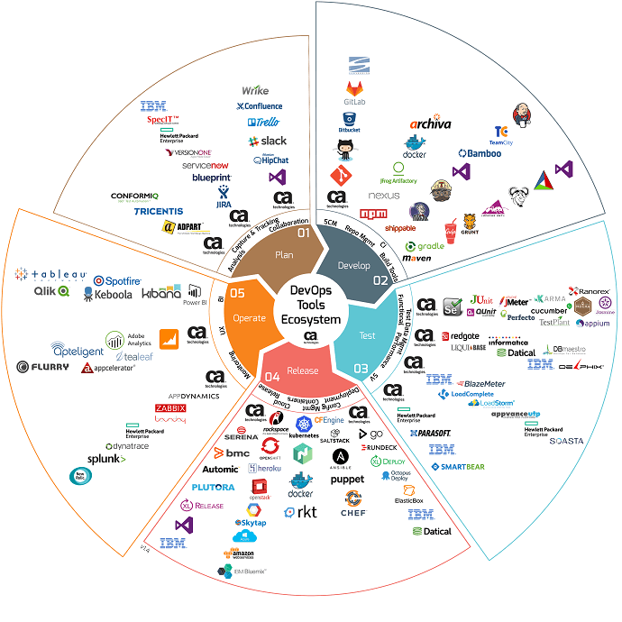

## Задание №2 - Описание жизненного цикла задачи (разработки нового функционала)

### Постановка задачи
Составить схему жизненного цикла разработки программного обеспечения.

### Решение
Основная задача DevOps - обеспечение автоматизированного, быстрого и безопасного развёртывания приложения для команды и клиентов.

Следующая диаграмма подробно рисует цикл разработки программного обеспечения: 

Здесь: 
1. Планирование - обсуждение желаемых фичей для бизнеса менеджерами.
2. Разработка - процесс разработки приложения архитекторами и девелоперами.
3. Тестирование - тестирование разработанного кода Quality Analysis командой.
4. Релиз - continuous integration and continuous deployment(CI/CD) кода, которое обеспечивает DevOps.
5. Мониторинг - внутренних и внешних ресурсов по среде и работе приложения (DevOps). 

Между каждым шагом  должна быть обратная связь.
