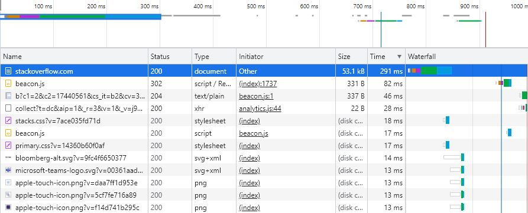
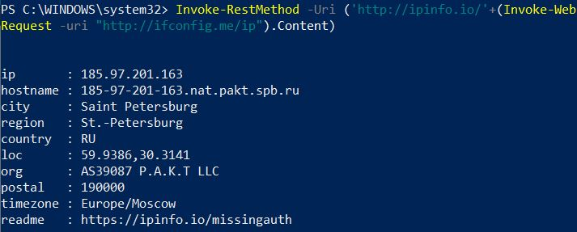
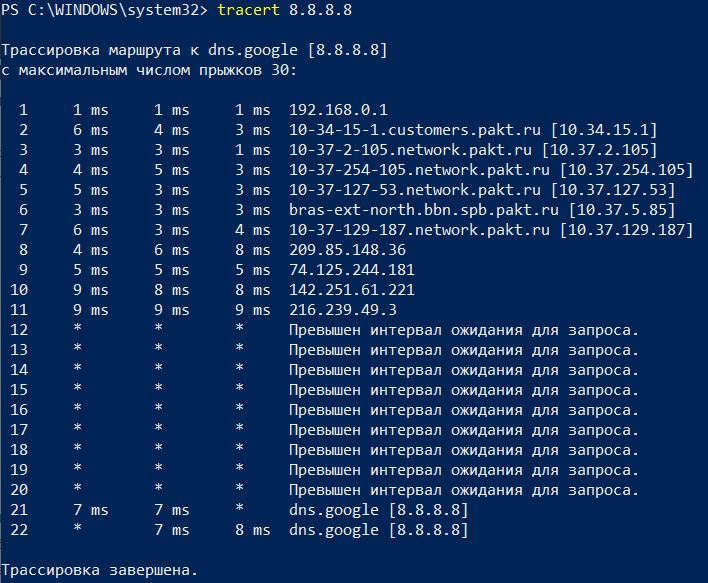
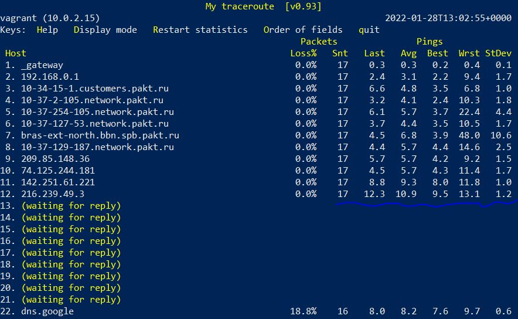
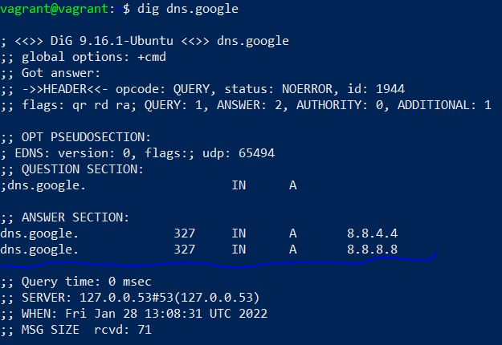

# Домашнее задание к занятию "3.6. Компьютерные сети, лекция 1"

1. Работа c HTTP через телнет.
- Подключитесь утилитой телнет к сайту stackoverflow.com
`telnet stackoverflow.com 80`
- отправьте HTTP запрос
```bash
GET /questions HTTP/1.0
HOST: stackoverflow.com
[press enter]
[press enter]
```


- В ответе укажите полученный HTTP код, что он означает?
код [301 Moved Permanently](https://en.wikipedia.org/wiki/HTTP_301)
2. Повторите задание 1 в браузере, используя консоль разработчика F12.
- откройте вкладку `Network`
- отправьте запрос http://stackoverflow.com
- найдите первый ответ HTTP сервера, откройте вкладку `Headers`
- укажите в ответе полученный HTTP код.\
`200`\

- проверьте время загрузки страницы, какой запрос обрабатывался дольше всего?

- приложите скриншот консоли браузера в ответ.
3. Какой IP адрес у вас в интернете?\

4. Какому провайдеру принадлежит ваш IP адрес? Какой автономной системе AS? Воспользуйтесь утилитой `whois`\

5. Через какие сети проходит пакет, отправленный с вашего компьютера на адрес 8.8.8.8? Через какие AS? Воспользуйтесь утилитой `traceroute`\

6. Повторите задание 5 в утилите `mtr`. На каком участке наибольшая задержка - delay?\

7. Какие DNS сервера отвечают за доменное имя dns.google? Какие A записи? воспользуйтесь утилитой `dig`\

8. Проверьте PTR записи для IP адресов из задания 7. Какое доменное имя привязано к IP?
