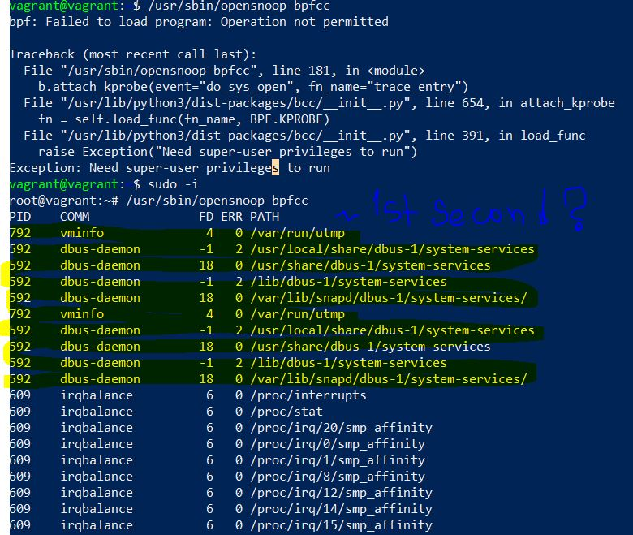
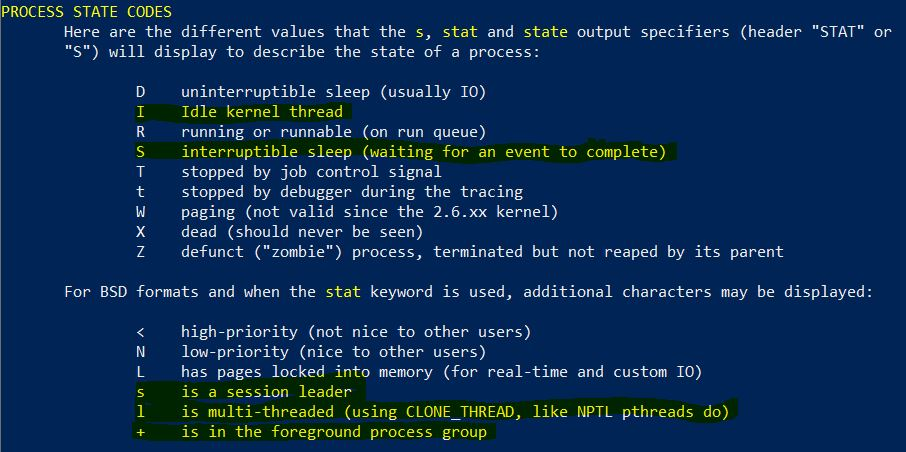

# Домашнее задание к занятию "3.3 Операционные системы, лекция 1"

1. `chdir("/tmp" )`
2. `/usr/share/misc/magic.mgc`
3. `vagrant@vagrant:~$ echo '' >/proc/1224/fd/2` where `1224` is the PID of text redactor process, `2` - opened deleted file descriptor.
4. Zombie processes don't use any system resources, but they do retain their process ID. Maybe a tiny amount of memory to store its process descriptor.
5. 
6. `execve("/usr/bin/uname", ["uname", "-a"], 0x7ffcaf721278 /* 24 vars */) = 0`
.JPG)
7. `command1 && command2`
command2 will be executed if (and only if) command1 returns exit status zero \
`command1 ; command2`
both command1 and command2 will be executed regardless the status, since the semicolon allows you to type multiple commands on one line. \
`set -e` stops the execution of a script if a command or pipeline has an error - which is the opposite of the default shell behaviour (ignore errors in scripts), so  using `&&` with `set -e` is pointless.
8. `set -euxo pipefail` is short for:\
`set -e` - option instructs bash to immediately exit if any command [1] has a non-zero exit status; \
`set -u` - when set, a reference to any variable you haven't previously defined - with the exceptions of $* and $@ - is an error, and causes the program to immediately exit with printing the error message to `stderr`; \
`set -x`- enables a mode of the shell where all executed commands are printed to the terminal; \
`set -o pipefail` -  prevents errors in a pipeline from being masked: the return value of a pipeline is the value of the last (rightmost) command to exit with a non-zero status, or zero if all commands in the pipeline exit successfully. The option is disabled by default. \
Using all the options above at the same time should improve error logging and stop the run at the step where error occurs.
9. The most repeatable processes are the ones with S and I (for example Ssl,Ss+,I<).

