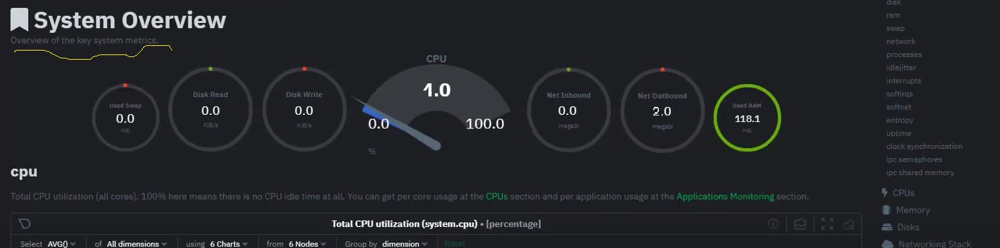
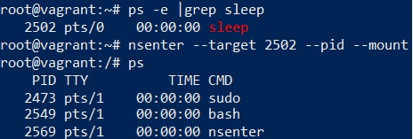

# Домашнее задание к занятию "3.4. Операционные системы, лекция 2"

1. Установила, запустила, проверить можно грепом по процессам, чек повторять после стопа или старта:
- `ps -e |grep node_ex` - чек процесса;
- `systemctl stop node_ex` - стоп процесса;
- `systemctl start node_ex` - старт процесса. \

Кат конфига `node_exporter.service`:
```bash
[Unit]
Description=Node Exporter

[Service]
User=node_exporter
Group=node_exporter
Type=simple
ExecStart=/usr/local/bin/node_exporter

[Install]
WantedBy=multi-user.target
```

2. Метрик много, не уверена, нужно ли было перечислять все или некоторые.

| CPU | Memory | Disk | Network |
| ------------- | ------------- | ------------- | ------------- |
| process_cpu_seconds_total(note: also for guest) node_cpu_seconds_total{cpu="0",mode="idle"} 8.9854454e+06 node_cpu_seconds_total{cpu="0",mode="iowait"} 6523.35 node_cpu_seconds_total{cpu="0",mode="irq"} 0 node_cpu_seconds_total{cpu="0",mode="nice"} 142.5 node_cpu_seconds_total{cpu="0",mode="softirq"} 7615.78 node_cpu_seconds_total{cpu="0",mode="steal"} 18.29 node_cpu_seconds_total{cpu="0",mode="system"} 68221.63 node_cpu_seconds_total{cpu="0",mode="user"} 433552.25` | node_memory_MemAvailable_bytes node_memory_MemFree_bytes | node_disk_io_now node_disk_io_time_seconds_total node_disk_io_time_weighted_seconds_total node_disk_read_bytes_total node_disk_read_time_seconds_total node_disk_reads_completed_total node_disk_reads_merged_total node_disk_write_time_seconds_total node_disk_writes_completed_total node_disk_writes_merged_total node_disk_written_bytes_total | node_network_receive_bytes_total node_network_receive_compressed_total node_network_receive_drop_total node_network_receive_errs_total node_network_receive_fifo_total node_network_receive_frame_total node_network_receive_multicast_total node_network_receive_packets_total node_network_transmit_bytes_total node_network_transmit_carrier_total node_network_transmit_colls_total node_network_transmit_compressed_total node_network_transmit_drop_total node_network_transmit_errs_total node_network_transmit_fifo_total node_network_transmit_packets_total |

3. 
4. В аутпуте `dmesg` есть данные о виртуализации/, `KVM` `oracle`:
````shell
vagrant@vagrant:~$ dmesg |grep virtual
[    0.002900] CPU MTRRs all blank - virtualized system.
[    0.090278] Booting paravirtualized kernel on KVM
[    2.874596] systemd[1]: Detected virtualization oracle.
````
5. `fs.nr_open` - это максимальное количество открытий файловых дескрипторов в одном процессе. По умолчанию значение для `fs.nr_open` - `1024*1024 = 1048576` \
`ulimit`- ограничения текущего процесса, например количество одновременно открытых файлов. \
`-Sn` or `-Hn`- софт и хард лимит, соответственно. Софт - можно изменить, хард нет.
6. 
7. `:(){ :|:& };:`- форма DoS атаки, рекурсивное исполнение функцией самой себя ([описание вот тут](https://www.cyberciti.biz/faq/understanding-bash-fork-bomb/))
Слайс по юзеру говорит, что `cgroup: fork rejected by pids controller`, значит исполнение функции не смогло форкнуть процесс и система дестабилизировалась.
Чтобы исправить исполнение, нужно его ограничить по времени или по числу допустимых процессов. По времени ограничивать в данном случае несовсем верный выбор, так как мы точно не знаем, 
когда будет достигнут лимит, значит, наш выбор - ограничить число процессов для юзера, например: `ulimit -u 10` 