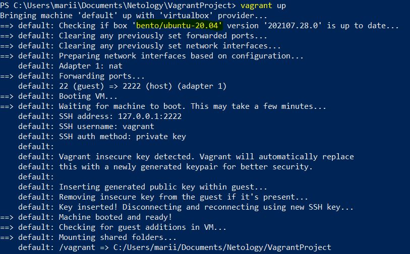
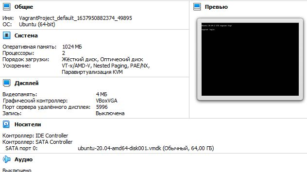
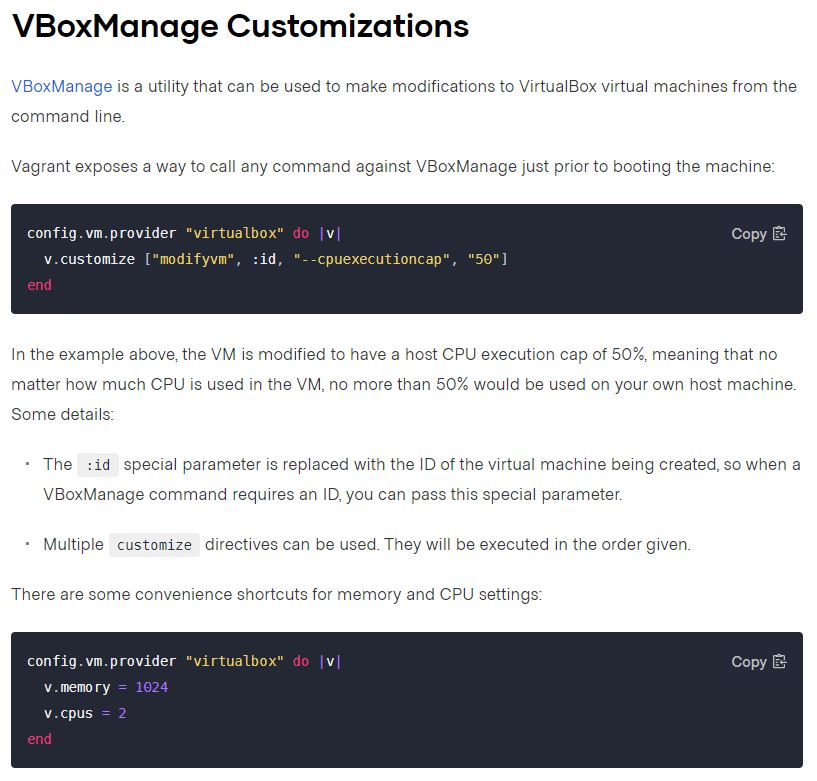
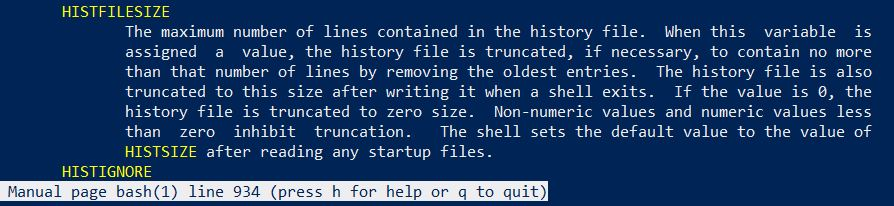
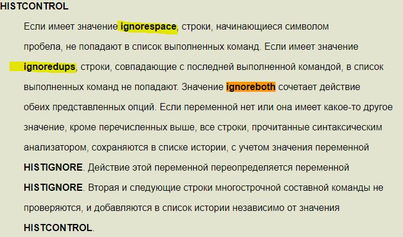
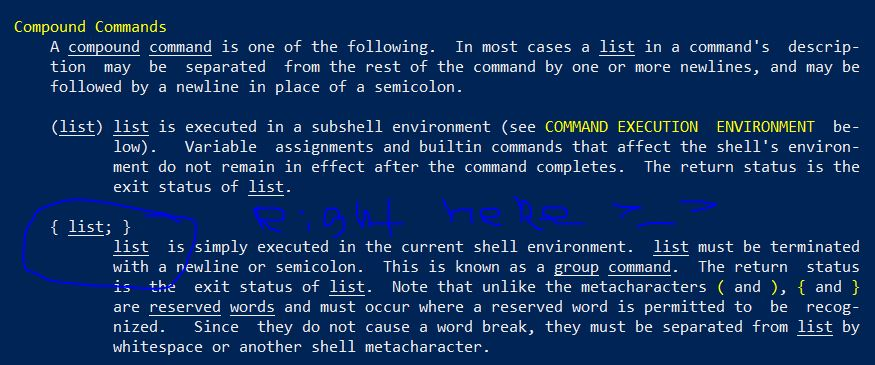
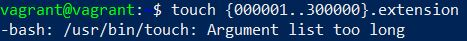
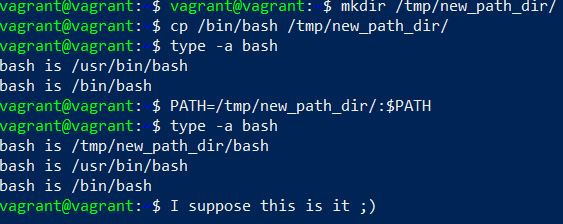
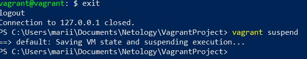

# Домашнее задание к занятию "3.1. Работа в терминале, лекция 1"

1-4. Up: \

5. Resources: \

6. Config can help to add some memory or/and cpu: \

7. trust me, ssh'ed
8. man bash:
- not sure about the exact page, but somewhere here: \

- histcontrol details: \

9. `{}` curly braces are used as arrays builder, parameter expansion, placeholder for text, code blocks and redirection, saving output to a file, for grouping, coma separated list of commands, `{} \` is used for pathname.
`{}` - are commonly used in script cycles. Elements from the list are used for substitution, JIC, man bash: \

10. `touch {000001..100000}.extension` theoretically, the file count should be limited by your disk space only if there are no other explicitly set limitations. Practically `touch {000001..300000}.extension` bumps into the arguments limit:

11. `[[ -d /tmp ]]` - checks condition y -d /tmp and returns binary state 0/1, presence of catalogue /tmp
12. Here you go: \

13. Google said:
- `at` - start at certain time later, ex. `at now + 5 hours -f ~/myscript.sh`;
- `batch` - start the command when the machine is idle.
14. bb: \
