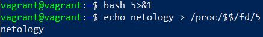

# Домашнее задание к занятию "3.2. Работа в терминале, лекция 2"

1. `cd` is a basic shell builtin command that uses the shell environment variables to determine necessary information for its execution. `cd` goal is to change shell's working directory (cwd), so using a build-in command for the purpose seems to be on point, since the alternative is to use an external script or prog for changing directories, however this external script execution itself will have to use current working directory to run it. So instead of using an external process that will still run in a dir, it appears to be right make cd a build-in command.
2. `grep <some_string> <some_file> -c`
3. 
4. 
5. Passing data of ~0 to ~1: \
`cat <some_file_0 >some_file_1`
6. Pseudo terminal allows to pass data from PTY > TTY emulator, however, by default the output appears in non-graphic mode. [Read details in here](https://tldp.org/HOWTO/Text-Terminal-HOWTO-7.html)
7. `bash 5>&1` - creates descriptor and redirects it to `stdout`, `echo netology > /proc/$$/fd/5` - output is this descriptor that we have created earlier: \

8. `ls -l /root 3>&2 2>&1 1>&3 | grep ls -c`
9. `cat /proc/$$/environ` lists environment variables, alternatives are `env` and `printenv`.
10.  
11. 
12. By default, when you run a command on the remote machine using ssh, a TTY is not allocated for the remote session. 
However, when you run ssh without a remote command, it DOES allocate a TTY, because you are likely to be running a shell session. It's expecting an interactive terminal on a tty device on the intermediate server.
If you want a 2nd shell session, you will have to force TTY allocation during remote execution with the `-t`: \
`ssh -t localhost 'tty'` \
Alternatively you can use a proxy jump or change a config.
13. Tried, worked after some permissions fixes.
14. `tee` duplicates the output to both to the file and to the stdout. In case of `echo string | sudo tee /root/new_file` stdin output is piped from stdout of the echo command and sudo grants write access rights to edit the new_file.