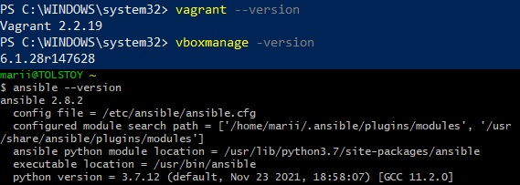
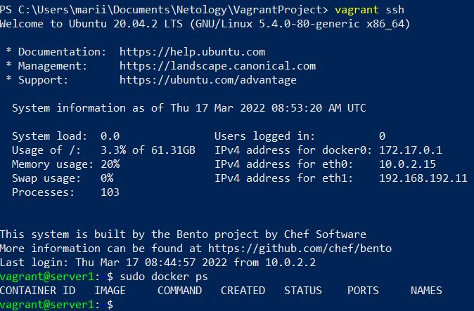

# Домашнее задание к занятию "5.2. Применение принципов IaaC в работе с виртуальными машинами"

---

## Задача 1

- Опишите своими словами основные преимущества применения на практике IaaC паттернов. \

IaaC существенно облегчает развертывание сред для разработки и тестирования приложений.
Процесс развертки становится быстрым, стабильным и предсказуемым, это помогает разработчикам, тестировщикам и другим инженерам работать быстрее и эффективнее.
Основное преимущество лично для меня - исключение человеческого фактора, экономия времени и унифицированая поддержка инфраструктуры.

- Какой из принципов IaaC является основополагающим?

Идемпотентность (повторяемость операции с одним и тем же результатом).

## Задача 2

- Чем Ansible выгодно отличается от других систем управление конфигурациями?

Главное отличие Ansible от соперников - работа по (возможно уже существующему и настроенному) ssh, в то время как конкуренты завязаны на установку PKI (ключи).

- Какой, на ваш взгляд, метод работы систем конфигурации более надёжный push или pull?

Ответ зависит скорее от отдельно поставленных задач, опыта инженера и стека компании - надёжен для чего?
В личном опыте могу только сказать, что универсальнее иметь и то, и то.
Как понимаю, различие между push и pull в том, кто инициирует запрос. 
Pull - более выгодный для поддержки структуры, если на машинах ведётся постоянная работа и конфиг машины меняется людьми. Можно настроить pull после изменения чего-то на машине.
Push - более простой (хотя тоже может требовать предуставновки на таргете), выглядит целесообразным для использования с контейнерами.

## Задача 3

Установить на личный компьютер:

- VirtualBox
- Vagrant
- Ansible

*Приложить вывод команд установленных версий каждой из программ, оформленный в markdown.*



## Задача 4 (*)

Воспроизвести практическую часть лекции самостоятельно.

- Создать виртуальную машину.
- Зайти внутрь ВМ, убедиться, что Docker установлен с помощью команды
```
docker ps
```

