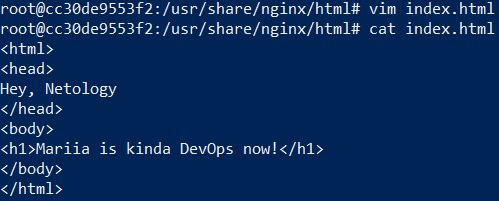

# Домашнее задание к занятию "5.3. Введение. Экосистема. Архитектура. Жизненный цикл Docker контейнера"

## Задача 1

Сценарий выполения задачи:

- создайте свой репозиторий на https://hub.docker.com;
- выберете любой образ, который содержит веб-сервер Nginx;
- создайте свой fork образа;
- реализуйте функциональность:
запуск веб-сервера в фоне с индекс-страницей, содержащей HTML-код ниже:
```
<html>
<head>
Hey, Netology
</head>
<body>
<h1>I’m DevOps Engineer!</h1>
</body>
</html>
```
Опубликуйте созданный форк в своем репозитории и предоставьте ответ в виде ссылки на https://hub.docker.com/username_repo.



`https://hub.docker.com/r/kiselyova/nginx`

## Задача 2

Посмотрите на сценарий ниже и ответьте на вопрос:
"Подходит ли в этом сценарии использование Docker контейнеров или лучше подойдет виртуальная машина, физическая машина? Может быть возможны разные варианты?"

Детально опишите и обоснуйте свой выбор.

--

Сценарий:

- Высоконагруженное монолитное java веб-приложение; \
аппаратная виртуализация для работы с высокой нагрузкой, контейнеризация не подходит
- Nodejs веб-приложение; \
в даном случае подходит контейнеризация докера для веб приложения (маштабируемость, среда)
- Мобильное приложение c версиями для Android и iOS; \
неочень знакома с веб приложениями, но знаю, что iOS обычно вызывает проблемы, и  для сборки под неё вряд ли получится использовать linux/win.
можно разделить процесс и собирать всё на виртуальных машиных, либо собирать отдельно Android в докере, а iOS на мак оси (виртуалка или железка, если есть).
- Шина данных на базе Apache Kafka; \
так же - контейнеризация (маштабируемость, среда)
- Elasticsearch кластер для реализации логирования продуктивного веб-приложения - три ноды elasticsearch, два logstash и две ноды kibana; \
в живом исполнении попадалось только на виртуалках, но интернет говорит, что есть опыт успешного применения с разделением
виртуалка-контейнеры. ноды эластика хранить на виртуалках, а кибану и логстеш в контейнерах. не уверена, на сколько логично делить реализацию.
- Мониторинг-стек на базе Prometheus и Grafana; \
не требуется хранение данных, поэтому докер
- MongoDB, как основное хранилище данных для java-приложения; \
виртуальная машина или сервер
- Gitlab сервер для реализации CI/CD процессов и приватный (закрытый) Docker Registry. \
не требуется хранение данных, поэтому докер

## Задача 3

- Запустите первый контейнер из образа ***centos*** c любым тэгом в фоновом режиме, подключив папку ```/data``` из текущей рабочей директории на хостовой машине в ```/data``` контейнера;
```bash
vagrant@server1:~$ sudo docker pull centos
Using default tag: latest
latest: Pulling from library/centos
a1d0c7532777: Pull complete
Digest: sha256:a27fd8080b517143cbbbab9dfb7c8571c40d67d534bbdee55bd6c473f432b177
Status: Downloaded newer image for centos:latest
docker.io/library/centos:latest
vagrant@server1:~$ sudo docker run -d -v ${PWD}:/data -it centos bash
bae75d17511adf53c4bb56eb0e0a3ed438125e893e3113aa0b6de63dd4af42bd
```
- Запустите второй контейнер из образа ***debian*** в фоновом режиме, подключив папку ```/data``` из текущей рабочей директории на хостовой машине в ```/data``` контейнера;
```bash
vagrant@server1:~$ sudo docker pull debian
Using default tag: latest
latest: Pulling from library/debian
5492f66d2700: Pull complete
Digest: sha256:b42494c466d101bf06038e959e2e5acd227e1251987e79528e7d8b1f4040deaf
Status: Downloaded newer image for debian:latest
docker.io/library/debian:latest
vagrant@server1:~$ sudo docker run -d -v ${PWD}:/data -it debian bash
cb0903937b0d2e8d978c27a213782d689f5bea9f58f9786cbcd5c4ce27626d57
```
- Подключитесь к первому контейнеру с помощью ```docker exec``` и создайте текстовый файл любого содержания в ```/data```;
```bash
vagrant@server1:~$ sudo docker exec -it centos bash
Error: No such container: centos
vagrant@server1:~$ sudo docker ps
CONTAINER ID   IMAGE                 COMMAND                  CREATED         STATUS         PORTS                                        NAMES
cb0903937b0d   debian                "bash"                   2 minutes ago   Up 2 minutes                                                loving_brown
bae75d17511a   centos                "bash"                   4 minutes ago   Up 4 minutes                                                festive_payne
81a800ff4648   kiselyova/nginx:1.1   "nginx -g 'daemon of…"   32 hours ago    Up 32 hours    443/tcp, 0.0.0.0:83->80/tcp, :::83->80/tcp   angry_bhabha
7de959a08ef4   1830fcc00fff          "nginx -g 'daemon of…"   32 hours ago    Up 32 hours    443/tcp, 0.0.0.0:82->80/tcp, :::82->80/tcp   practical_blackwell
3553a3723606   kiselyova/nginx:0.1   "nginx -g 'daemon of…"   32 hours ago    Up 32 hours    443/tcp, 0.0.0.0:81->80/tcp, :::81->80/tcp   sweet_stonebraker
vagrant@server1:~$ sudo docker exec -it bae75d17511a bash
[root@bae75d17511a /]# echo hello_world > data/hello.txt
[root@bae75d17511a /]# exit
exit 
```
- Добавьте еще один файл в папку ```/data``` на хостовой машине;
```bash
vagrant@server1:~/data$ pwd
/home/vagrant/data
vagrant@server1:~/data$ echo bye_world > bye.txt
```
- Подключитесь во второй контейнер и отобразите листинг и содержание файлов в ```/data``` контейнера.
```bash
vagrant@server1:~$ sudo docker exec -it cb0903937b0d bash
root@cb0903937b0d:/# cd data &&ls -l
total 32
-rw-rw-r-- 1 1000 1000    10 Mar 26 04:39 bye.txt
drwxrwxr-x 2 1000 1000  4096 Mar 26 04:33 data
-rwxrwxr-x 1 1000 1000 18617 Mar 17 08:46 get-docker.sh
-rw-r--r-- 1 root root    12 Mar 26 04:29 hello.txt
```

## Задача 4 (*)

Воспроизвести практическую часть лекции самостоятельно.

Соберите Docker образ с Ansible, загрузите на Docker Hub и пришлите ссылку вместе с остальными ответами к задачам.


---

### Как cдавать задание

Выполненное домашнее задание пришлите ссылкой на .md-файл в вашем репозитории.

---