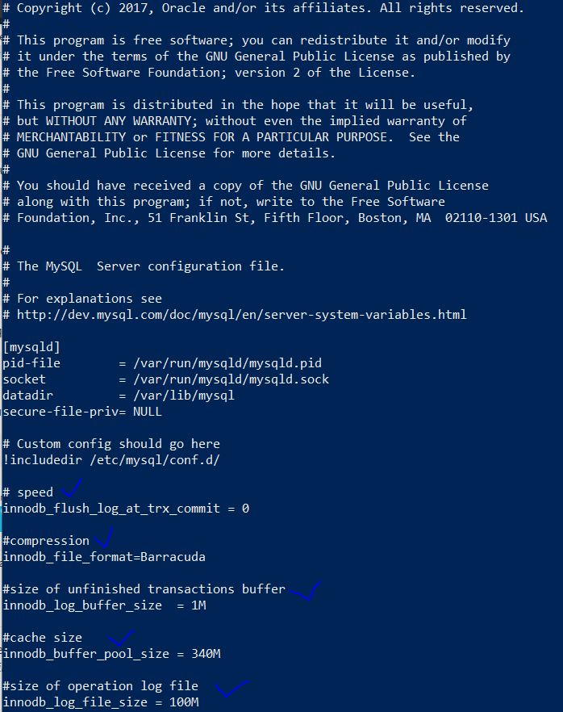

# Домашнее задание к занятию "6.3. MySQL"

## Введение

Перед выполнением задания вы можете ознакомиться с 
[дополнительными материалами](https://github.com/netology-code/virt-homeworks/tree/master/additional/README.md).

## Задача 1

Используя docker поднимите инстанс MySQL (версию 8). Данные БД сохраните в volume.
```bash
vagrant@server1:~$ sudo docker pull mysql:8
8: Pulling from library/mysql
a4b007099961: Pull complete
e2b610d88fd9: Pull complete
38567843b438: Pull complete
5fc423bf9558: Pull complete
aa8241dfe828: Pull complete
cc662311610e: Pull complete
9832d1192cf2: Pull complete
f2aa1710465f: Pull complete
4a2d5722b8f3: Pull complete
3a246e8d7cac: Pull complete
2f834692d7cc: Pull complete
a37409568022: Pull complete
Digest: sha256:b2ae0f527005d99bacdf3a220958ed171e1eb0676377174f0323e0a10912408a
Status: Downloaded newer image for mysql:8
docker.io/library/mysql:8
```
Изучите [бэкап БД](https://github.com/netology-code/virt-homeworks/tree/master/06-db-03-mysql/test_data) и 
восстановитесь из него.
```bash
vagrant@server1:~$ sudo docker volume create mysql_db
mysql_db
vagrant@server1:~$ sudo wget https://github.com/netology-code/virt-homeworks/blob/master/06-db-03-mysql/test_data/test_dump.sql
--2022-03-27 06:52:34--  https://github.com/netology-code/virt-homeworks/blob/master/06-db-03-mysql/test_data/test_dump.sql
Resolving github.com (github.com)... 140.82.121.4
Connecting to github.com (github.com)|140.82.121.4|:443... connected.
HTTP request sent, awaiting response... 200 OK
Length: unspecified [text/html]
Saving to: ‘test_dump.sql’

test_dump.sql                    [  <=>                                       ] 144.51K   509KB/s    in 0.3s

2022-03-27 06:52:35 (509 KB/s) - ‘test_dump.sql’ saved [147980]

vagrant@server1:~$ sudo docker run --rm --name mysql-docker -e MYSQL_ROOT_PASSWORD=password -d -p 8080:8080 -v mysql_db:/var/ mysql:8
96e38365bda851becfdebe35308456a26d303149221b82846daad3c3ff789dc2
vagrant@server1:~$ sudo docker cp test_dump.sql mysql-docker:/var/test_dump.sql
```
Перейдите в управляющую консоль `mysql` внутри контейнера.
```bash
vagrant@server1:~$ sudo docker exec -it mysql-docker sh
# mysql -uroot -p"password"
mysql: [Warning] Using a password on the command line interface can be insecure.
Welcome to the MySQL monitor.  Commands end with ; or \g.
Your MySQL connection id is 10
Server version: 8.0.28 MySQL Community Server - GPL

Copyright (c) 2000, 2022, Oracle and/or its affiliates.

Oracle is a registered trademark of Oracle Corporation and/or its
affiliates. Other names may be trademarks of their respective
owners.

Type 'help;' or '\h' for help. Type '\c' to clear the current input statement.
```
as alternate option to enter I've used:
```bash
vagrant@server1:~$ sudo docker exec -it mysql-docker mysql -p"password" mysql_dump
```

```bash
mysql> CREATE DATABASE mysql_dump;
mysql> show databases;
+--------------------+
| Database           |
+--------------------+
| information_schema |
| mysql              |
| mysql_dump         |
| performance_schema |
| sys                |
+--------------------+
5 rows in set (0.00 sec)

mysql> use mysql_dump
Database changed
mysql> source /var/test_dump.sql
mysql> show tables
    -> ;
+----------------------+
| Tables_in_mysql_dump |
+----------------------+
| orders               |
+----------------------+
1 row in set (0.00 sec)
```
Используя команду `\h` получите список управляющих команд.
```bash
mysql> \h

For information about MySQL products and services, visit:
   http://www.mysql.com/
For developer information, including the MySQL Reference Manual, visit:
   http://dev.mysql.com/
To buy MySQL Enterprise support, training, or other products, visit:
   https://shop.mysql.com/

List of all MySQL commands:
Note that all text commands must be first on line and end with ';'
?         (\?) Synonym for `help'.
clear     (\c) Clear the current input statement.
connect   (\r) Reconnect to the server. Optional arguments are db and host.
delimiter (\d) Set statement delimiter.
edit      (\e) Edit command with $EDITOR.
ego       (\G) Send command to mysql server, display result vertically.
exit      (\q) Exit mysql. Same as quit.
go        (\g) Send command to mysql server.
help      (\h) Display this help.
nopager   (\n) Disable pager, print to stdout.
notee     (\t) Don't write into outfile.
pager     (\P) Set PAGER [to_pager]. Print the query results via PAGER.
print     (\p) Print current command.
prompt    (\R) Change your mysql prompt.
quit      (\q) Quit mysql.
rehash    (\#) Rebuild completion hash.
source    (\.) Execute an SQL script file. Takes a file name as an argument.
status    (\s) Get status information from the server.
system    (\!) Execute a system shell command.
tee       (\T) Set outfile [to_outfile]. Append everything into given outfile.
use       (\u) Use another database. Takes database name as argument.
charset   (\C) Switch to another charset. Might be needed for processing binlog with multi-byte charsets.
warnings  (\W) Show warnings after every statement.
nowarning (\w) Don't show warnings after every statement.
resetconnection(\x) Clean session context.
query_attributes Sets string parameters (name1 value1 name2 value2 ...) for the next query to pick up.

For server side help, type 'help contents'
```
Найдите команду для выдачи статуса БД и **приведите в ответе** из ее вывода версию сервера БД.
```bash
mysql> \s
--------------
Server version:         8.0.28 MySQL Community Server - GPL
--------------
```
Подключитесь к восстановленной БД и получите список таблиц из этой БД.
```bash
mysql> show databases;
+--------------------+
| Database           |
+--------------------+
| information_schema |
| mysql              |
| mysql_dump         |
| performance_schema |
| sys                |
+--------------------+
5 rows in set (0.00 sec)
```
**Приведите в ответе** количество записей с `price` > 300.
```bash
mysql> select count(*) from orders where price >300;
+----------+
| count(*) |
+----------+
|        1 |
+----------+
1 row in set (0.00 sec)
```
В следующих заданиях мы будем продолжать работу с данным контейнером.

## Задача 2

Создайте пользователя test в БД c паролем test-pass, используя:
- плагин авторизации mysql_native_password
- срок истечения пароля - 180 дней 
- количество попыток авторизации - 3 
- максимальное количество запросов в час - 100
- аттрибуты пользователя:
    - Фамилия "Pretty"
    - Имя "James"

```bash
mysql> CREATE USER
    -> 'testuser'@'localhost' IDENTIFIED WITH mysql_native_password BY 'test-pass'
    -> REQUIRE NONE WITH MAX_QUERIES_PER_HOUR 100
    -> PASSWORD EXPIRE INTERVAL 180 DAY
    -> FAILED_LOGIN_ATTEMPTS 3
    -> ACCOUNT LOCK
    -> ATTRIBUTE '{"firstname":"James", "lastname":"Pretty"}';
Query OK, 0 rows affected (0.01 sec)
```

Предоставьте привелегии пользователю `test` на операции SELECT базы `test_db`.
```bash
mysql> GRANT SELECT ON mysql_dump.* TO 'testuser'@'localhost';
Query OK, 0 rows affected, 1 warning (0.00 sec)
```
    
Используя таблицу INFORMATION_SCHEMA.USER_ATTRIBUTES получите данные по пользователю `test` и 
**приведите в ответе к задаче**.
```bash
mysql> SELECT * FROM INFORMATION_SCHEMA.USER_ATTRIBUTES WHERE user='testuser';
+----------+-----------+----------------------------------------------+
| USER     | HOST      | ATTRIBUTE                                    |
+----------+-----------+----------------------------------------------+
| testuser | localhost | {"lastname": "Pretty", "firstname": "James"} |
+----------+-----------+----------------------------------------------+
1 row in set (0.00 sec)
```

## Задача 3

Установите профилирование `SET profiling = 1`.
Изучите вывод профилирования команд `SHOW PROFILES;`.

Исследуйте, какой `engine` используется в таблице БД `test_db` и **приведите в ответе**.
```bash
mysql> SELECT engine FROM information_schema.TABLES WHERE table_name = 'orders' and  TABLE_SCHEMA = 'mysql_dump';
+--------+
| ENGINE |
+--------+
| InnoDB |
+--------+
1 row in set (0.00 sec)
```

Измените `engine` и **приведите время выполнения и запрос на изменения из профайлера в ответе**:
- на `MyISAM`
- на `InnoDB`
```bash
mysql>  ALTER TABLE orders ENGINE = MyISAM;
Query OK, 5 rows affected (0.03 sec)
Records: 5  Duplicates: 0  Warnings: 0

mysql>  ALTER TABLE orders ENGINE = InnoDB;
Query OK, 5 rows affected (0.03 sec)
Records: 5  Duplicates: 0  Warnings: 0

mysql> SHOW PROFILES;
+----------+------------+-----------------------------------------------------------------------------------------------------------+
| Query_ID | Duration   | Query                                                                                                     |
+----------+------------+-----------------------------------------------------------------------------------------------------------+
|        1 | 0.00100825 | SELECT engine FROM information_schema.TABLES WHERE table_name = 'orders' and  TABLE_SCHEMA = 'mysql_dump' |
|        2 | 0.02997325 | ALTER TABLE orders ENGINE = MyISAM                                                                        |
|        3 | 0.03239050 | ALTER TABLE orders ENGINE = InnoDB                                                                        |
+----------+------------+-----------------------------------------------------------------------------------------------------------+
3 rows in set, 1 warning (0.00 sec)
```

## Задача 4 

Изучите файл `my.cnf` в директории /etc/mysql.

Измените его согласно ТЗ (движок InnoDB):
- Скорость IO важнее сохранности данных
- Нужна компрессия таблиц для экономии места на диске
- Размер буффера с незакомиченными транзакциями 1 Мб
- Буффер кеширования 30% от ОЗУ
- Размер файла логов операций 100 Мб

Приведите в ответе измененный файл `my.cnf`.

