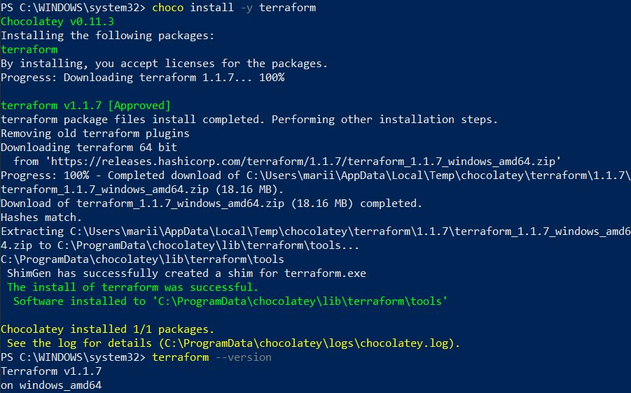
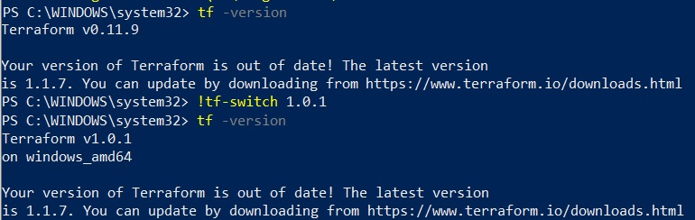

# Домашнее задание к занятию "7.1. Инфраструктура как код"

## Задача 1. Выбор инструментов. 
 
### Легенда
 
Через час совещание на котором менеджер расскажет о новом проекте. Начать работу над которым надо 
будет уже сегодня. 
На данный момент известно, что это будет сервис, который ваша компания будет предоставлять внешним заказчикам.
Первое время, скорее всего, будет один внешний клиент, со временем внешних клиентов станет больше.

Так же по разговорам в компании есть вероятность, что техническое задание еще не четкое, что приведет к большому
количеству небольших релизов, тестирований интеграций, откатов, доработок, то есть скучно не будет.  
   
Вам, как девопс инженеру, будет необходимо принять решение об инструментах для организации инфраструктуры.
На данный момент в вашей компании уже используются следующие инструменты: 
- остатки Сloud Formation, 
- некоторые образы сделаны при помощи Packer,
- год назад начали активно использовать Terraform, 
- разработчики привыкли использовать Docker, 
- уже есть большая база Kubernetes конфигураций, 
- для автоматизации процессов используется Teamcity, 
- также есть совсем немного Ansible скриптов, 
- и ряд bash скриптов для упрощения рутинных задач.  

Для этого в рамках совещания надо будет выяснить подробности о проекте, что бы в итоге определиться с инструментами:

1. Какой тип инфраструктуры будем использовать для этого проекта: изменяемый или не изменяемый? \
так как инфраструктура будет расти и меняться, изменяемый, но будем стремиться к неизменяемому.
2. Будет ли центральный сервер для управления инфраструктурой? \
нет, так как в данном случае будут использоваться преимущественно Ansible и Terraform.
3. Будут ли агенты на серверах? \
нет, так как для Ansible и Terraform они не нужны.
4. Будут ли использованы средства для управления конфигурацией или инициализации ресурсов? \
да, структуру нужно будет поддерживать и расширять, это удобнее делать с помощью средств конфигурации и инициализации ресурсов, тем более, такие ресурсы уже есть в компании.
5. Какие инструменты из уже используемых вы хотели бы использовать для нового проекта? \
как упоминалось выше: Ansible и Terraform. Так же будет целесообразно использовать Docker, он хорошо дополняет этот стек. Ряд скриптов никогда не помешает :)
6. Хотите ли рассмотреть возможность внедрения новых инструментов для этого проекта? \
Проект в начальной стадии, думаю, существуюшего набора будет более чем достаточно.

## Задача 2. Установка терраформ. 

Официальный сайт: https://www.terraform.io/

Установите терраформ при помощи менеджера пакетов используемого в вашей операционной системе.
В виде результата этой задачи приложите вывод команды `terraform --version`.

## Задача 3. Поддержка легаси кода. 

В какой-то момент вы обновили терраформ до новой версии, например с 0.12 до 0.13. 
А код одного из проектов настолько устарел, что не может работать с версией 0.13. 
В связи с этим необходимо сделать так, чтобы вы могли одновременно использовать последнюю версию терраформа установленную при помощи
штатного менеджера пакетов и устаревшую версию 0.12. 

В виде результата этой задачи приложите вывод `--version` двух версий терраформа доступных на вашем компьютере 
или виртуальной машине.

нашла вот такую опцию, создать исполнительный файл для свича:
[awesome tool](https://gist.github.com/lkurzyniec/da61b9b5cec71730c3b89cdfe31f37ff)

также можно использовать готовые тулзы-решения: tfswitch, tfenv.
