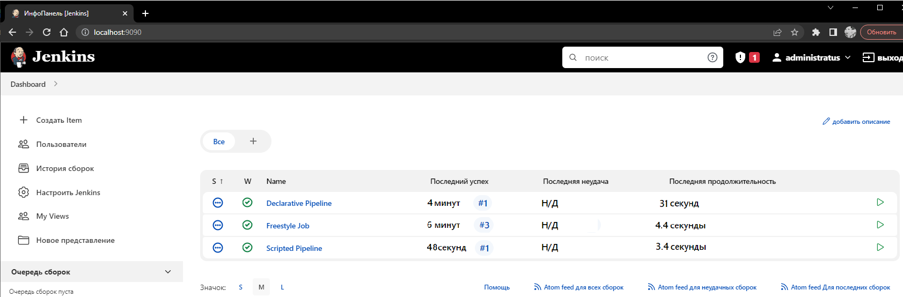

# Домашнее задание к занятию "09.03 Jenkins"

## Подготовка к выполнению

1. Установить jenkins по любой из [инструкций](https://www.jenkins.io/download/)
2. Запустить и проверить работоспособность
3. Сделать первоначальную настройку
4. Настроить под свои нужды
5. Поднять отдельный cloud
6. Для динамических агентов можно использовать [образ](https://hub.docker.com/repository/docker/aragast/agent)
7. Обязательный параметр: поставить label для динамических агентов: `ansible_docker`
8.  Сделать форк репозитория с [playbook](https://github.com/aragastmatb/example-playbook)

## Основная часть

Please see files in PoC

Dashboard view

